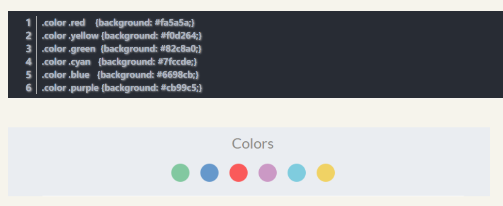

目录：
    src：存放应用程序使用的java文件
    gen：系统自动生成的目录，不需要更改。
    asset：存放应用程序使用的资源。这个文件夹存放的资源需要用二进制读取。将原封不动的打包进apk文件。
    bin：未签名的apk文件。
    libs：第三方jar文件目录。
    res：资源存储目录。
        res/drawable：存放不同分辨率的图片资源。按照分辨率从低到高：l -- m -- h -- xh -- xxh。
        res/layout：包含了应用程序使用到的一系列布局文件。
        menu：在程序右上角的菜单栏定义的内容。
        res/value：使用到的尺寸、样式、字符串等资源。
            @string/XXX引入
-------------------------------------------
颜色搭配：

-------------------------------------------
Layout：
    LinearLayout：线性布局
    RelativeLayout：相对布局
    FrameLayout：帧布局
    TableLayout：表格布局
    AbsoluteLayout：绝对布局
    GridLayout：网络布局

    嵌套不要超过10层，否则会大幅度降低运行效率！

单位：
    屏幕尺寸：屏幕对角线长度。单位为英寸。
        1英寸=2.54厘米
    屏幕分辨率：水平和垂直像素点的个数。单位为px。
        1px = 1像素点
    屏幕像素密度：每英寸上的像素点数。单位为dpi。
        1dpi = √分辨率 / 尺寸 => dp越大，越清晰
        ldpi -- mdpi -- hdpi  
    px：像素点。
    dip：设备独立像素。也是密度无关像素。以160dip为基准，1dip = 1px。所以可以先使用160进行比对后，按比例调节。
    dp：与dip相同。
    sp：字体专用
    
LinearLayout：
    orientation：用来指定当前线性布局的方向。
        vertical：垂直
        horizontal:水平（默认）
    layout_width、layout_height：
        wrap_content：匹配内容。
        match_parent：匹配父View。
    gravity：设置View内部的对齐方式。
    layout_gravity：设置View在其父View中的对齐方式。
        left：左对齐，right：右对齐，top：上对齐，bottom：下对齐，center：居中
        |：组合使用。
        如果线性方向为水平，那么水平方向的对齐方式无效，(horizontal -- left、right都无效，center只作用在水平方向)
        如果线性方向为垂直，那么垂直方向的对齐方式无效。(vertical -- top、bottom都无效，center只作用在垂直方向)
    layout_margin:外间距
        layout_marginTop = "30dp"
    padding:内边距
        padding = "30dp"
    layout_weight：占空余空间的比例。（match_parent -- 反相关；wrap_content -- 正相关）

RelativeLayout：
    layout_alignXXX:对齐方式
        layout_alignParentRight = "true"
        layout_alignParentLeft = "true"
        layout_alignParentTop = "true"
        layout_alignParentBottom = "true"
        layout_alignRight = "true"
        layout_alignLeft = "true"
        layout_alignTop = "true"
        layout_alignBottom = "true"
    layout_alignBaseLine:基准线对齐
    layout_centerXXX:居中
        layout_centerVertical = "true":垂直居中
        layout_centerHorizontal = "true":水平居中
        layout_centerInParent = "true":父类居中
    layout_XXX:在某个控件的某边
            layout_toRightOf = "@id/XXX"
            layout_toLeftOf = "@id/XXX"
            layout_toTopOf = "@id/XXX"
            layout_toBottomOf = "@id/XXX"
            layout_below = "@id/XXX"
    layout_margin:外间距
        layout_marginRight = "30dp"
        layout_marginLeft = "30dp"
        layout_marginTop = "30dp"
        layout_marginBottom = "30dp"
    padding:内边距
        padding = "30dp"
    
    一般不要定很多相关联的属性，否则耦合性就会大大增加。
    
TableLayout:
    TableRow:行（一个TableRow一个行）
        <TableRow/> -- 标签
    stretchColumn:拉伸列。使内容不再紧凑。
        android:stretchColumn = "0,1,2" -- 0,1,2列拉伸（使内容不再紧凑）
    shrinkColumns:回缩列。使内容得以完全显示。
        android:shrinkColumns = "0,1,2" -- 0,1,2列回缩（使内容得以完全显示）
    collapseColumns:隐藏列。
        android:collapseColumns = "0,1,2" -- 0,1,2列隐藏（列隐藏）
    例子：
        数值、列名 -- 居中显示 -- gravity = "center"(可以适当增加一些padding内边距)
        总数值 -- 居右显示 -- gravity = "right"
        
FrameLayout：帧布局
    后面会覆盖前面的View。
    一般使用在手机联系人的导航上
    
AbsoluteLayout：坐标布局（不推荐使用）
    layout_x
    layout_y
    由于手机屏幕尺寸差别较大，不建议使用
    
GridLayout：
    android4.0以上出现（minSdkVersion = "14"）
    columnCount = "4" -- 以4列显示
    layout_columnSpan = "2" -- 合并2列（配合layout_gravity = "fill"）
    layout_rowSpan = "2" -- 合并2行（配合layout_gravity = "fill"）
    layout_gravity：填充方式
    
GridLayout和TableLayout区别：
    1、TableLayout以TableRow来显示
       GridLayout直接使用
    2、TableLayout不可以合并
       GridLayout可以合并
       
-------------------------------------------
TextView：
    text：显示内容
    textSize：文字大小
    textColor：文字颜色
    visibility：是否显示（默认可见；invisible：不可见【当前区域保留】；gone：隐藏【当前区域不保留】）
    maxLength：最大长度（显示个数）
    maxLines：最大行数（显示行数）
    autoLink：超链接（web）
    跑马灯特效：（本人在一些自带模拟器上无法实现 -- 是使用海马玩模拟器可以显示）
        singleLine = "true" -- 单行显示
        ellipsize = "none" -- 取消"..."（start：在前面；middle：中间；end：最后（默认）；
                                                none：没有；marquee：跑马灯）
        focusable = "true" --获取焦点
        focusableInTouchMode = "true" --滑动获取焦点
        scrollHorizontally = "true" -- 是否水平滑动
    background：图片
    drawableTop/Left/Right/Bottom：在图片某个方向上显示文字
        